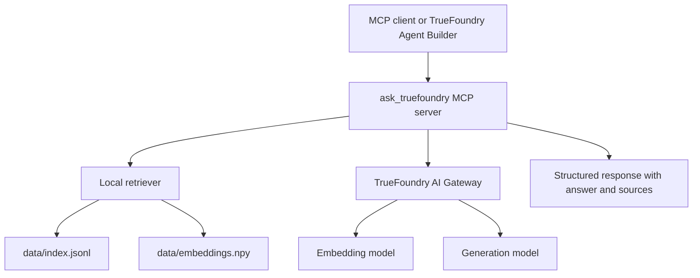

# AskTrueFoundry

AskTrueFoundry is a TrueFoundry-focused RAG MCP server. It answers questions using only TrueFoundry docs/blog/website content, returns source URLs, and exposes the capability as an MCP tool that can be attached to TrueFoundry Agent Builder.

## What It Includes

- TrueFoundry corpus ingestion from public docs/blog/website URLs
- embeddings through TrueFoundry AI Gateway
- local persisted retrieval index
- CLI question answering
- HTTP MCP server exposing `ask_truefoundry`
- Docker Compose local runtime
- Agent Builder instruction template
- graceful handling for unsupported questions, rate limits, and partial generations

## Architecture



Runtime flow:

1. The user asks a TrueFoundry question.
2. The client calls the `ask_truefoundry` MCP tool.
3. The MCP server embeds the query through TrueFoundry AI Gateway.
4. The local retriever selects relevant TrueFoundry chunks from the persisted index.
5. The MCP server generates an answer through TrueFoundry AI Gateway using only retrieved context.
6. The tool returns `status`, `answer`, `sources`, `retrieved_chunks`, and optional `error`.

## Repository Layout

```text
src/asktruefoundry/      application code
scripts/                 ingestion and MCP smoke-test scripts
configs/                 Agent Builder setup notes
tests/                   unit tests with no network dependency
data/                    generated local RAG artifacts, ignored by git
Dockerfile               MCP server container
docker-compose.yml       local MCP server runtime
```

## Setup

Use Python 3.11+.

```bash
python -m venv venv
source venv/bin/activate
pip install -e .
cp .env.example .env
```

Edit `.env`:

```bash
TRUEFOUNDRY_API_KEY=...
TFY_GATEWAY_BASE_URL=https://gateway.truefoundry.ai
TFY_GENERATION_MODEL=openai/gpt-5.4-nano
TFY_EMBEDDING_MODEL=openai/text-embedding-3-small
TFY_GENERATION_MAX_TOKENS=1200
ASKTF_MAX_CONTEXT_CHARS_PER_SOURCE=1800
ASKTF_TOP_K=4
ASKTF_MIN_SIMILARITY=0.15
```

Never commit `.env`.

## Build The RAG Index

Full ingestion:

```bash
PYTHONPATH=src venv/bin/python scripts/ingest.py
```

Defaults:

```text
max pages: 1000
progress interval: 25 pages
fetch retries: 2
embedding batch size: 64
embedding retries: 3
```

Generated files:

```text
data/index.jsonl
data/embeddings.npy
```

These files are ignored by git and can be regenerated locally.

Quick smoke ingestion:

```bash
PYTHONPATH=src venv/bin/python scripts/ingest.py --max-pages 40
```

## Ask Locally

```bash
PYTHONPATH=src venv/bin/python -m asktruefoundry.cli "why is TrueFoundry better than LiteLLM"
```

Structured output:

```bash
PYTHONPATH=src venv/bin/python -m asktruefoundry.cli \
  "why is TrueFoundry better than LiteLLM" \
  --json
```

Expected behavior:

- supported questions return grounded answers and source URLs
- unsupported questions return `I don't know based on TrueFoundry docs/blog.`
- rate limits return a retry message
- incomplete generations return `status=generation_stopped` with partial content preserved when available

## Run The MCP Server

Direct Python:

```bash
PYTHONPATH=src venv/bin/python -m asktruefoundry.mcp_server
```

Endpoint:

```text
http://127.0.0.1:8000/mcp
```

List tools:

```bash
PYTHONPATH=src venv/bin/python scripts/mcp_smoke.py
```

Call the tool:

```bash
PYTHONPATH=src venv/bin/python scripts/mcp_smoke.py \
  --question "why is TrueFoundry better than LiteLLM"
```

Docker Compose:

```bash
docker compose up --build
```

The container mounts `./data` read-only, so the local index can be regenerated without rebuilding the image.

## MCP Tool Contract

Tool:

```text
ask_truefoundry(question: str, max_sources: int = 4)
```

Response shape:

```json
{
  "status": "ok | no_evidence | rate_limited | generation_stopped | error",
  "answer": "answer text",
  "sources": [
    {"title": "Source title", "url": "https://www.truefoundry.com/..."}
  ],
  "retrieved_chunks": [
    {"id": "chunk id", "title": "Source title", "url": "https://...", "score": 0.88}
  ],
  "error": null
}
```

Status handling:

- `ok`: answer is complete and grounded.
- `no_evidence`: retrieved context did not support the question.
- `rate_limited`: TrueFoundry AI Gateway returned `429`.
- `generation_stopped`: the model stopped before a normal finish. If partial answer text exists, it is returned in `answer` with sources and a warning.
- `error`: unexpected application or gateway failure.

## TrueFoundry Configuration

### AI Gateway

The code uses the OpenAI-compatible TrueFoundry AI Gateway endpoint:

```text
https://gateway.truefoundry.ai
```

It sends metadata headers on gateway calls:

```json
{"application": "asktruefoundry", "traffic": "embedding"}
{"application": "asktruefoundry", "traffic": "generation"}
```

These metadata values make traces and policies easier to filter.

### Model Gateway Rate Limit

Example rate-limit policy:

```text
Target: generation model used by the agent
Limit: 2 requests per minute
Metadata filter:
  application = asktruefoundry
  traffic = generation
```

### MCP Gateway

Register the MCP server as a remote MCP server. During local development, run the server locally and expose:

```text
http://127.0.0.1:8000/mcp
```

through an HTTPS tunnel ending in `/mcp`.

TrueFoundry MCP Gateway should discover:

```text
ask_truefoundry
```

### Agent Builder

Attach:

- an AI Gateway model
- the registered `ask_truefoundry` MCP server

Recommended instructions are in:

```text
configs/agent-builder-instructions.md
```

Core behavior:

- always call `ask_truefoundry` for TrueFoundry questions
- answer only from tool output
- include source URLs
- refuse unsupported questions with the exact no-evidence message

## Tests

```bash
PYTHONPATH=src venv/bin/python -m unittest discover -s tests
```

The tests avoid network calls and cover:

- text extraction
- URL discovery resilience
- retrieval ordering
- prompt/source behavior
- unknown-answer handling
- partial generation handling
- MCP response mapping

## Production Directions

Potential follow-ups:

- deploy the MCP server as a TrueFoundry Service instead of using a local tunnel
- store generated RAG artifacts in object storage or a managed artifact store
- replace the local NumPy retriever with a production vector store or TrueFoundry RAG framework
- add more robust boilerplate removal during ingestion
